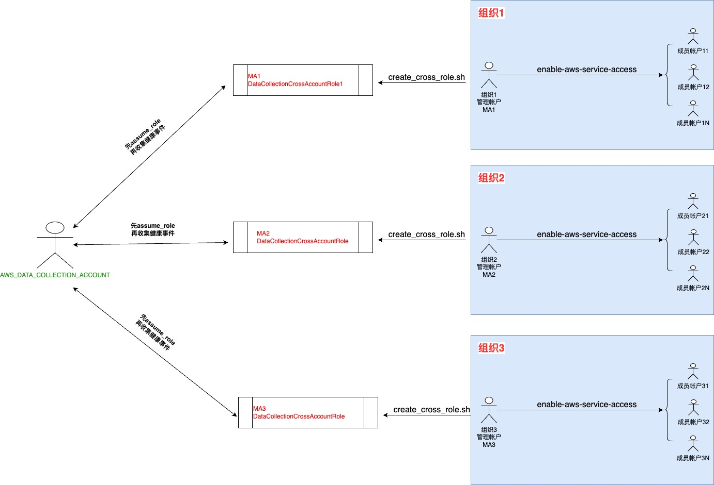
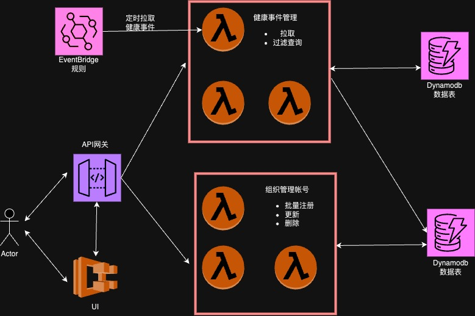

# 健康事件管理平台

这是一个跨帐号管理其它 AWS 组织帐号健康事件的管理平台，它提供了相关的 API 接口以及简洁的 UI 实现。通过本项目，可以轻松管理多个组织帐号下的所有授权帐号的 AWS 健康事件，并提供一个(可选安装的)整合管理界面对所有事件进行可视化及操作。


## 目录

1. [部署指南](#部署指南)
   - [前置要求](#前置要求)
   - [组织帐号端](#组织帐号端)
   - [数据收集端](#数据收集端)
     - [后端基础设施](#后端基础设施)
     - [前端 UI](#前端-ui)
   - [部署步骤](#部署步骤)
2. [API 使用](#api-使用)
    - [注册组织帐号](#注册组织帐号)
    - [拉取健康事件](#拉取健康事件)
    - [（可选）更新帐号信息](#可选更新帐号信息)
    - [（可选）解除注册帐号](#可选解除注册帐号)
3. [前端 UI 使用](#前端-ui-使用)
    - [前端部署说明](#前端部署说明)
    - [本地运行前端](#本地运行前端)

---

## 部署指南

 ****

 上图展示了如何跨帐号收集多组织健康事件的一个流程图，以下是分别讲解。

### 前置要求

在部署本项目之前，首先需要确保组织（Organization）的管理账户（Management Account）已获得授权，以便能够查看和管理组织中所有成员账户的健康事件。可以在每个组织的**管理账户**中，执行以下命令来启用 AWS Health 服务的访问：

```bash
aws organizations enable-aws-service-access --service-principal health.amazonaws.com
```

这个命令作用是：允许 AWS Health 服务访问组织内所有账户的健康事件数据。这个命令**不会**向组织中的其他账户发送通知或邮件，也无需成员账户进行额外的批准。这个命令完成后，管理账户就可以集中查看和管理组织内所有账户的健康事件。

建议在运行这个命令前，先获取成员帐户的许可。

### 组织帐号端

需要部署本项目的 AWS 帐号记为：`AWS_DATA_COLLECTION_ACCOUNT`。

1. 在**每个**组织的管理帐号中，运行 `deploy/management_accounts/create_cross_role.sh` 脚本。
   - 该脚本将创建允许 `AWS_DATA_COLLECTION_ACCOUNT` 拉取相关组织及其成员健康事件的 IAM 角色及权限。
   - 请参考 `deploy/management_accounts/README.md` 了解详细用法。
   - 记下每个管理帐号及其对应创建的 IAM 角色信息。

### 数据收集端

在数据收集端，我们需要部署一个完整的后端基础设施来处理健康事件的收集和管理。这包括 API Gateway、Lambda 函数和 DynamoDB 表的部署，以及可选的前端 UI。

下图展示了整个后端基础设施的结构：

 ****

#### **后端基础设施**

- **API Gateway**：提供统一的 HTTP 接口，用于接收和处理来自各个组织帐号的请求。
- **Lambda 函数**：作为 API Gateway 的后端，处理具体的业务逻辑，如事件拉取、查询和管理。
- **DynamoDB**：用于存储健康事件和帐号信息。

这个后端基础设施的定义在 `deploy/data_collection/cdk_infra/backend_stack.py` 中。

#### **前端 UI**

此外，本项目还包含一个用于展示健康事件和管理信息的前端 UI（部署在 AWS ECS 中）。前端 UI 的定义在 `deploy/frontend/frontend_stack.py` 中。

### 部署步骤

1. **安装 AWS CDK**：
   - 请确保已经安装了 AWS CDK。可以使用以下命令安装：
     ```bash
     npm install -g aws-cdk
     ```

2. **安装依赖**：
   - 进入 `deploy/data_collection` 目录，安装所需的 Python 依赖：
     ```bash
     pip install -r requirements.txt
     ```

3. **配置 AWS 凭证**：
   - 确保已配置好 AWS 凭证，并且使用的是 `AWS_DATA_COLLECTION_ACCOUNT` 的凭证。 请自行搜索安装`aws-cli`工具，然后运行`aws configure`进行配置。

4. **设置前置环境变量**:
     ```bash
     export DEPLOY_ENVIRONMENT='dev' # 开发用'dev', 正式部署用'prod'
     ```

4. **构建并推送UI Docker 镜像（可选）**：
   - **如果不需要部署前端，可以直接跳过此步骤**。
   - 这一步是构建前端UI代码的Docker镜像并推送到Amazon ECR仓库，CDK中会基于这个image把前端部署到Amazon ECS上。如果更新了前端代码，需要重做这一步。
   - 如果你选择部署前端，请进入 `deploy/frontend` 目录，运行以下命令构建并推送前端的 Docker 镜像到 ECR：
     ```bash
     cd deploy/frontend
     ./build_and_push.sh <region> <tag>
     ```
     注意：`region` 是 AWS 区域（例如 `us-east-1`），`tag` 是镜像的标签，默认为 `latest`。

5. **部署基础设施**：
   - 在 `deploy/data_collection/cdk_infra` 目录下运行以下命令来部署 CDK 堆栈：
     ```bash
     cdk deploy --all
     ```

6. **记录 API 端点**：
   - 部署完成后，CDK 的输出将包含一个类似于 `https://su8suqixml.execute-api.<some region>.amazonaws.com/prod/` 的值，记为 `AwsHealthDashboardApiEndpoint`。将其记录下来，记为 `API_ENDPOINT`。

7. **前端应用的 URL**：
   - 如果前端已部署成功，CDK 的输出还将包含前端应用的 URL，如下所示：
   ```
   FrontendStack.FrontendURL = http://<your-environment-name>.<your-region>.elb.amazonaws.com
   ```
   你可以通过这个 URL 访问并登录到健康事件管理平台的前端 UI。

[回到目录](#目录)

---

## API 使用

部署完成后，可以选择使用 API 进行操作，也可以选择使用 UI 操作。如果选择 UI 操作，请跳过本节，直接查看[UI使用](#前端-UI-使用)。

### 注册组织帐号

1. 发送一个 POST 请求到 `$API_ENDPOINT/register_accounts` 注册所有组织帐号。请求体包含要注册的帐号 ID、跨账户角色名称和允许用户的信息。请求示例如下：

   ```bash
   curl -X POST $API_ENDPOINT/register_accounts  \
        -H "Content-Type: application/json" \
        -d '{
            "123456789012": {
                "cross_account_role": "RoleName",
                "allowed_users": {
                    "email1@example.com": "John Doe",
                    "email2@example.com": "Jane Doe"
                }
            },
            "098765432109": {
                "cross_account_role": "AnotherRoleName",
                "allowed_users": {
                    "email1@example.com": "John Doe",
                    "email3@example.com": "Alice",
                    "email4@example.com": "Bob"
                }
            }
        }'
   ```

    - `123456789012` 和 `098765432109`：这是需要注册的 AWS 帐号 ID，每个 ID 应为 12 位数字。
    - `cross_account_role`：跨账户角色的名称，用于访问其他组织的健康事件数据。
    - `allowed_users`：允许访问该帐号的用户列表，以键值对形式表示，键为用户的电子邮件地址，值为用户的姓名。这个字段可以不填，之后有需要增加再用下文讲的 /update_account 接口更新。

#### 示例解释

- **注册帐号 123456789012**：
  ```json
  "123456789012": {
      "cross_account_role": "RoleName",
      "allowed_users": {
          "email1@example.com": "John Doe",
          "email2@example.com": "Jane Doe"
      }
  }
  ```
  注册 AWS 帐号 `123456789012`，使用角色 `RoleName` 进行跨账户访问，并允许 `email1@example.com` 和 `email2@example.com` 这两个用户访问该帐号的数据，分别对应的用户名为 `John Doe` 和 `Jane Doe`。

- **注册帐号 098765432109**：
  ```json
  "098765432109": {
      "cross_account_role": "AnotherRoleName",
      "allowed_users": {
          "email1@example.com": "John Doe",
          "email3@example.com": "Alice",
          "email4@example.com": "Bob"
      }
  }
  ```
  注册 AWS 帐号 `098765432109`，使用角色 `AnotherRoleName` 进行跨账户访问，并允许 `email1@example.com`、`email3@example.com` 和 `email4@example.com` 这三个用户访问该帐号的数据，分别对应的用户名为 `John Doe`、`Alice` 和 `Bob`。

### 拉取健康事件

1. 完成注册后，在本项目部署区域的当地时间每天凌晨 2 点将自动触发拉取所有组织帐号关联的所有健康事件的操作。
2. 如需立即拉取，可以发送一个 POST 请求到 `$API_ENDPOINT/fetch_health_events`。该操作

将拉取所有组织帐号相关的健康事件并存储到 DynamoDB 中，以备后续查询（默认拉取过去 90 天的事件）。请求示例如下：

   ```bash
   curl -X POST $API_ENDPOINT/fetch_health_events  \
        -H "Content-Type: application/json" \
        -d '{"account_ids": ["123456789012", "098765432109"]}'
   ```
    - "account_ids"列表是前面刚注册的帐号列表。也可以不传，那这会触发全量帐号的拉取操作(不只是刚注册的帐号)

### （可选）更新帐号信息

在完成健康事件的拉取之后，你还可以选择更新帐号的用户信息，这个操作主要用于确保只有授权用户可以访问帐号相关数据。以下是更新帐号的 API 描述和示例：

1. 发送一个 PUT 请求到 `$API_ENDPOINT/update_account` 更新帐号的用户信息。请求体包含 `account_id` 和 `params` 字段，`params` 字段可以包含三个子字段：`add`、`delete` 和 `update`，用于添加、删除和更新用户信息。请求示例如下：

    ```bash
    curl -X PUT $API_ENDPOINT/update_account  \
        -H "Content-Type: application/json" \
        -d '{
            "account_id": "123456789012",
            "params": {
                "add": {
                    "email1@example.com": "John Doe"
                },
                "delete": {
                    "email2@example.com": null
                },
                "update": {
                    "email3@example.com": "Jane Doe"
                }
            }
        }'
    ```

    - `account_id`：要更新的 AWS 帐号 ID。
    - `params`：
      - `add`：需要添加的用户，格式为 `{"用户邮箱": "用户名"}`。
      - `delete`：需要删除的用户，格式为 `{"用户邮箱": null}`。
      - `update`：需要更新的用户，格式为 `{"用户邮箱": "新用户名"}`。

#### 示例解释

- **添加用户**：
  ```json
  "add": {
      "email1@example.com": "John Doe"
  }
  ```
  将用户 `email1@example.com` 添加到允许访问此帐号的用户列表中，并设置用户名为 `John Doe`。

- **删除用户**：
  ```json
  "delete": {
      "email2@example.com": null
  }
  ```
  将用户 `email2@example.com` 从允许访问此帐号的用户列表中删除。

- **更新用户**：
  ```json
  "update": {
      "email3@example.com": "Jane Doe"
  }
  ```
  更新用户 `email3@example.com` 的用户名为 `Jane Doe`。

通过上述 API，你可以方便地管理和更新能够查看 AWS 帐号健康事件的用户信息，从而确保只有授权用户可以访问相关数据。

### （可选）解除注册帐号

如果某个帐号停用，你还可以选择解除某些帐号的注册。以下是解除注册帐号的 API 描述和示例：

1. 发送一个 DELETE 请求到 `$API_ENDPOINT/deregister_accounts` 来批量解除注册多个帐号。请求体包含一个 `account_ids` 字段，字段值为需要解除注册的帐号 ID 列表。请求示例如下：

    ```bash
    curl -X DELETE $API_ENDPOINT/deregister_accounts \
        -H "Content-Type: application/json" \
        -d '{
            "account_ids": ["123456789012", "098765432109"]
        }'
    ```

    - `account_ids`：需要解除注册的 AWS 帐号 ID 列表。

通过上述 API，你可以方便地批量解除多个 AWS 帐号的注册，确保不再处理这些帐号的健康事件数据。

[回到目录](#目录)

---

## 前端 UI 使用

### 前端部署说明

默认情况下，前端会与后端一起部署。部署完成后，`cdk deploy`输出中将包含前端应用的 URL，你可以通过这个 URL 访问并登录到健康事件管理平台的前端 UI:

```
FrontendStack.FrontendURL = http://<your-environment-name>.<your-region>.elb.amazonaws.com
```

通过这个 URL，你可以直接访问并使用前端 UI 进行健康事件的管理操作。

### 本地运行前端

如果你选择不在云上部署前端，也可以在本地运行UI，进行开发或测试。以下是步骤：

1. **安装 Node.js 和 npm**：
   - 请确保已经安装了 Node.js 和 npm，可以通过以下命令安装：
     ```bash
     # 使用包管理器安装 Node.js 和 npm
     # 例如在 Ubuntu 上：
     sudo apt-get install nodejs npm
     ```

2. **安装前端依赖**：
   - 进入 `frontend` 目录，运行以下命令安装依赖：
     ```bash
     npm install
     ```

3.  **配置 API 端点**：
   - 在本地运行时，前端应用需要知道 API Gateway 的端点。你可以在 `frontend/.env` 文件中配置 `API_ENDPOINT` 来指定 API Gateway 的 URL, 这个
   `API_ENDPOINT`的值请参考前面部署的章节。

4. **本地运行前端应用**：
   - 在 `frontend` 目录下运行以下命令编译，并启动：
     ```bash
     npm run build && npm start
     ```
   - 前端应用将在本地的 `http://localhost:3000` 运行。

[回到目录](#目录)
